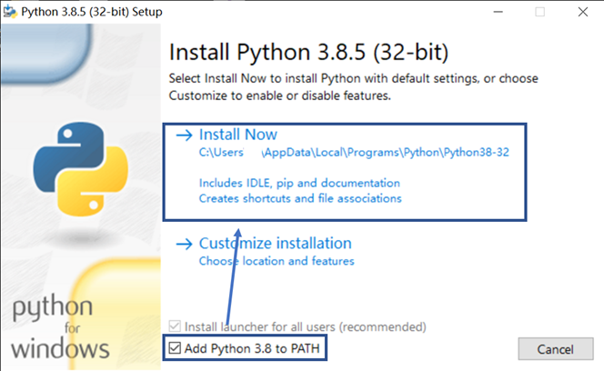
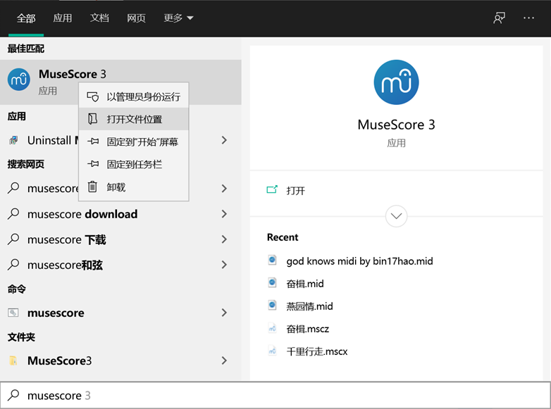
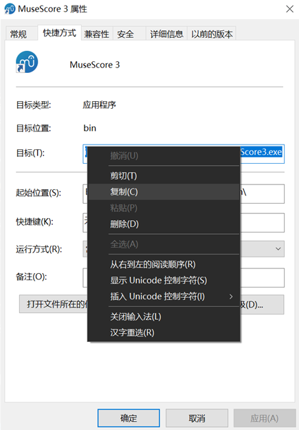

# 准备工作

## python的安装
在[python官网](https://www.python.org/)下载python安装包

双击运行，勾选"Add Python 3.8 to PATH"，点击"Install Now"



## dvfile及依赖库的安装
按win+R，输入cmd，回车，打开命令提示符，输入以下内容

```
pip install dvfile
pip install utaufile
pip install mido
pip install music21
```
（music21库较大，如果你不需要导出五线谱，可以不装）

## musescore的安装与环境配置
如果要导出五线谱，则需要安装musescore

在[musescore官网](https://www.musescore.org/)下载musescore安装包，双击运行。

安装完成后，在windows搜索框中输入“musescore”，右键，打开文件位置



右键点击文件夹中的musescore快捷方式，属性，复制“目标”一项



win+R，输入python，回车，打开python命令行。输入以下内容：
```
from music21 import *
us = environment.UserSettings()
us['musescoreDirectPNGPath'] = r"<你的musescore位置>"
us['musicxmlPath'] = r"<你的musescore位置>"
```
其中<你的musescore位置>替换为刚才复制的快捷方式目标