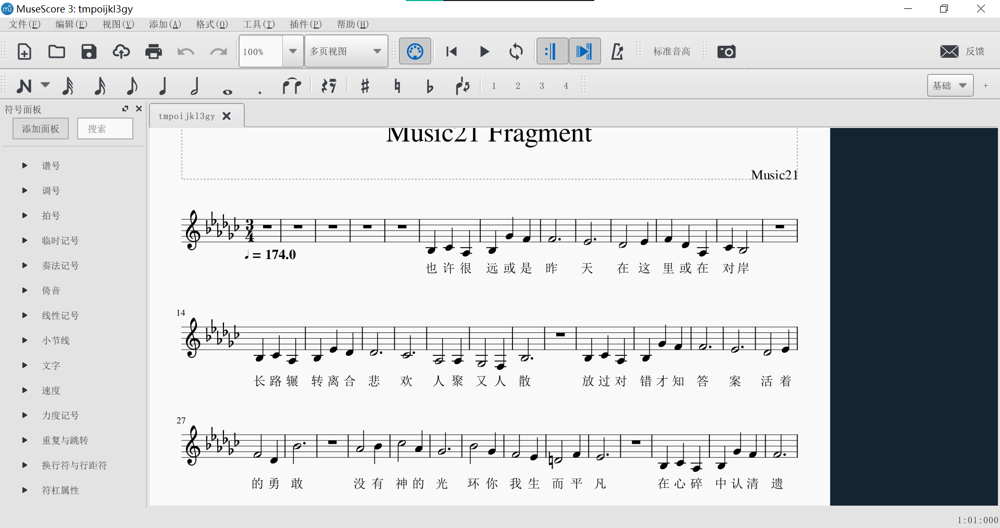

# 基本文件操作
这一章以项目文件夹下的“zhiyaopingfan.dv”（只要平凡，作曲：黄超，作词：格格）为例，介绍dvfile的基本文件操作。
## 打开文件
首先导入dvfile库
```py
>>> import dvfile
```
用opendv打开文件，返回一个dv文件对象
```py
>>> d=dvfile.opendv("zhiyaopingfan.dv")
>>> type(d)
<class 'dvfile.Dvfile'>
```
可以用print打印出来以便快速查看。

注意：dvfile库中各种对象，print输出的内容在后续版本的dvfile中随时可能调整与优化，应仅用于命令行交互与程序调试，不建议解析字符串后继续利用数据。
```py
>>> print(d)
[(0, 174.0)]
[(-3, 3, 4)]
 track 歌声-音轨
  segment 5760 111360 新区段 飞梦_CHN_Normal_Build006
   7200 480 58 也 ye
   7680 480 59 许 xu
   8160 480 56 很 hen
   8640 480 58 远 yuan
   9120 480 66 或 huo
   9600 480 65 是 shi
   10080 1440 65 昨 zuo
   11520 1440 63 天 tian
   12960 960 61 在 zai
   13920 480 63 这 zhe
   14400 480 65 里 li
   14880 480 61 或 huo
   15360 480 56 在 zai
   15840 480 59 对 dui
   16320 960 58 岸 an
......
```
## 保存文件
dv文件对象可以用save方法保存为dv文件
```py
>>> d.save("zhiyaopingfan2.dv")
```

## 文件格式转换
dv文件对象可以导出ust、nn、mid文件
```py
>>> d.to_ust_file().save("zhiyaopingfan.ust")#导出ust（需要utaufile）
>>> d.to_nn_file().save("zhiyaopingfan.nn")#导出nn（需要utaufile）
>>> d.to_midi_file().save("zhiyaopingfan.mid")#导出mid（需要mido）
```
dvfile在导出文件时，如果目标文件不支持汉字拼音双重歌词（ust、mid、music21），则默认使用拼音歌词以保证大多数引擎的兼容性。如果需要导出汉字歌词，请使用use_hanzi=True参数
```py
d.to_midi_file(use_hanzi=True).save("zhiyaopingfan.mid")
```


## 导出五线谱
安装music1 musescore，并按照上一章的方法配置好环境后，可以导出五线谱
```py
>>> d.to_music21_score(use_hanzi=True).show()
```
由于music21库很大，这行代码需要等待几秒钟，然后会打开musescore窗口并显示五线谱，可以导出为图片或pdf文件。
